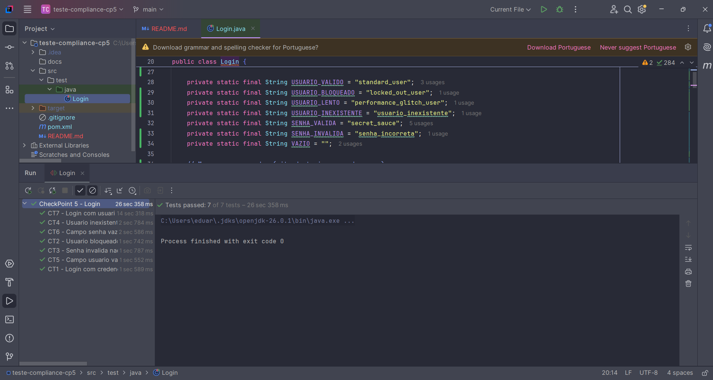

# CheckPoint 5 — Automação de Testes Funcionais

Automação dos cenários de login do plano de testes do CheckPoint 4, aplicado ao
site de treino [saucedemo.com](https://www.saucedemo.com/).

**Stack:** Java 17 · Maven · JUnit 5 · Selenium WebDriver 4

---

## Casos de teste automatizados

| ID | Cenário | Resultado esperado |
|----|---------|--------------------|
| CT1 | Login com credenciais válidas (`standard_user`) | Redireciona para `inventory.html`, título "Products" e ícone do carrinho visível |
| CT2 | Login com usuário bloqueado (`locked_out_user`) | Permanece no login com a mensagem de usuário bloqueado |
| CT3 | Login com senha inválida | Permanece no login com a mensagem de credenciais inválidas |
| CT4 | Login com usuário inexistente | Mesma mensagem genérica do CT3 (não revela qual campo errou) |
| CT5 | Campo usuário em branco | Mensagem de campo usuário obrigatório |
| CT6 | Campo senha em branco | Mensagem de campo senha obrigatório |
| CT7 | Login com usuário de resposta lenta (`performance_glitch_user`) | Conclui o login dentro do timeout usando espera explícita |

Cada método de teste segue a estrutura Gherkin do plano (**Dado / Quando / E / Então**),
marcada em comentários.

---

## Como executar

Pré-requisitos: JDK 17+, Maven e Google Chrome atualizado.
O ChromeDriver é baixado automaticamente pelo Selenium Manager na primeira execução.

```bash
mvn clean test
```

Para rodar um caso específico:

```bash
mvn test -Dtest=Login#deveLogarComCredenciaisValidas
```

Pela IDE: botão de execução ao lado da classe `Login` ou de cada `@Test`.

---

## Decisões técnicas

- **Asserções do JUnit, não a palavra-chave `assert` do Java.** A `assert` nativa
  depende da flag `-ea` na JVM e fica desligada por padrão no Surefire — a verificação
  simplesmente não executa e o teste passa mesmo com falha real.
- **`WebDriverWait` no lugar de `Thread.sleep`.** A condição é verificada a cada 500 ms
  e o teste segue no instante em que ela é satisfeita; o timeout de 15 s é teto, não espera.
- **Locators por `id` / `data-test`,** centralizados em constantes `By`. Nenhum XPath absoluto.
- **Dados e URLs em constantes.** Trocar de ambiente é alterar `BASE_URL`.
- **`ChromeOptions` desativa o gerenciador de senhas do Chrome,** que abre um diálogo
  nativo após o login e derruba o teste por motivo alheio ao sistema sob teste.

---

## Evidência de execução


